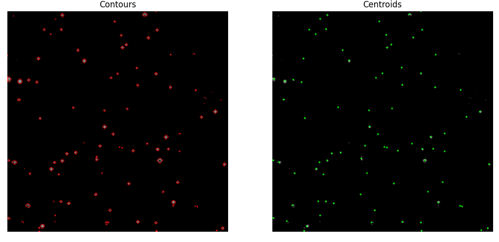
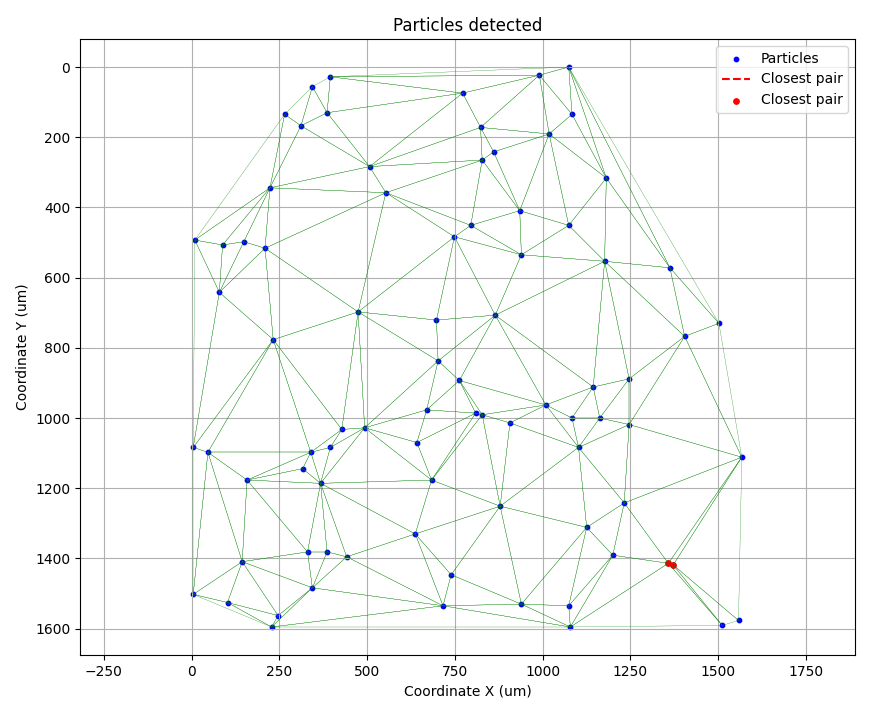

# Particle Analysis Project

The **Particle Analysis Project** is a Python-based application designed to automate the process of detecting, analyzing, and visualizing particles in images. It provides a set of tools for particle detection using advanced image processing techniques, calculates relevant metrics such as the closest pair of particles, and visualizes the results in intuitive plots. The project leverages the power of libraries such as OpenCV, NumPy, SciPy, and Matplotlib to perform tasks like image binarization, contour detection, and Delaunay triangulation. This makes it ideal for applications in scientific analysis, material science, and medical image processing, where particle detection and measurement are essential.

The project is organized in a modular way to ensure easy integration into other systems. It includes functionalities to process multiple sample images, visualize particle distributions, and calculate distances between particles. This can be useful in fields such as microscopy, material analysis, or any area where particle tracking is crucial.

Key highlights include:
- **Customizable Image Preprocessing**: Allows for adjustments to enhance the detection of particles in varying lighting conditions.
- **Particle Detection**: Automatically detects particles based on contours and centroid calculation.
- **Distance Calculation**: Computes the closest pair of particles and visualizes the result.
- **Triangular Mesh Visualization**: Uses Delaunay triangulation to visualize the relationships between particles in a mesh format.
- **Scalability**: Easily extendable to handle new data formats, more complex images, or additional particle metrics.


<p align="center">
  
</p>

<p align="center">
  
</p>


<!-- <div style="display: flex; justify-content: space-between; width: 100%;">
  
  
</div> -->


---

## Features

- **Particle Detection**:
  - Detects particles in images through contour detection and centroid calculation.
  - Provides preprocessing options like Gaussian blur and CLAHE (Contrast Limited Adaptive Histogram Equalization) to enhance image quality and improve particle visibility.
  - Handles different types of images, including those with varying resolutions and background noise.

- **Visualization**:
  - **Particle Visualization**: Plots all detected particles and highlights their centroids for easy interpretation.
  - **Closest Pair Visualization**: Optionally, highlights the closest pair of particles and draws a line between them to visualize the minimum distance.
  - **Triangular Mesh**: Visualizes the particles' relationships using Delaunay triangulation, showing how particles are connected in the form of a mesh.
  - **Customizable Plots**: Provides the flexibility to adjust the display, including axis labels, gridlines, and legends for better presentation.

- **Metrics Calculation**:
  - **Closest Pair of Particles**: Calculates the distance between the closest pair of particles based on their centroids and visualizes the result.
  - **Scalable Distance Calculations**: Capable of handling large sets of particles and computing their distances efficiently.
  - **Dynamic Updates**: The particle distance and mesh updates in real time as new images are processed.

- **Extensibility**:
  - Designed in a modular way, allowing easy extension or integration into other projects.
  - The `Particle` and `ParticleCalculator` classes can be used independently for particle detection and distance analysis, respectively.

- **Sample Image Processing**:
  - Can handle multiple sample images in a batch process, making it suitable for large-scale analyses where consistency across multiple images is necessary.
  - Ability to configure image paths for easy integration into different workflows.

- **Scale Calculation**:
  - **Image Calibration**: Computes the scale of images based on a reference image with a known physical size.
  - Adjusts the measurements and outputs distances in user-defined units (e.g., micrometers).

---

## Installation

To set up this project, ensure you have Python and Git installed on your system. Follow the steps below:

### Prerequisites

1. **Install Python**:
   - Download Python from [python.org](https://www.python.org/downloads/).
   - Ensure you check the box *Add Python to PATH* during installation.
   - Verify the installation:
     ```bash
     python --version
     ```
     or, depending on your system:
     ```bash
     python3 --version
     ```

2. **Install Git**:
   - Download Git from [git-scm.com](https://git-scm.com/).
   - Follow the installation instructions for your operating system.
   - Verify the installation:
     ```bash
     git --version
     ```

---

### Steps to Set Up the Project

1. **Clone the repository**:
   ```bash
   git clone https://github.com/AleCornejoR/particle-proxy-dist.git
   cd particle-proxy-dist
   ```

2. **Create and activate a virtual environment**:
   - On Linux/Mac:
     ```bash
     python3 -m venv venv
     source venv/bin/activate
     ```
   - On Windows:
     ```bash
     python -m venv venv
     venv\Scripts\activate
     ```

3. **Install the required Python libraries**:
   ```bash
   pip install -r requirements.txt
   ```

4. **Verify the setup**:
   - Ensure that the necessary dependencies (like OpenCV, NumPy, Matplotlib, and SciPy) are installed:
     ```bash
     pip list
     ```
   - Run a quick test to ensure the environment works:
     ```bash
     python main.py
     ```
   - If you encounter issues, ensure the correct Python version (3.8 or later) is installed and used in the virtual environment.


---

## Usage

1. **Run the main script**:  
   Ensure your input images are configured in the `sample_paths` list. Additionally, set up a reference image to calculate the scale. Then run:
   ```bash
   python main.py
   ```

2. **Modules**:  
   - `ImageProcessor`: Detects particles, applies preprocessing, and calculates their centroids.
   - `ParticleCalculator`: Analyzes the detected particles, provides metrics, and generates visualizations.

3. **Key Features**:
   - Detect particles from sample images.
   - Calculate and highlight the closest pair of particles.
   - Visualize a triangulated mesh of particles using Delaunay triangulation.

4. **Important**:  
   Before processing any sample images, you must create an instance for the reference image. The reference image is used to calculate the scale for accurate measurements. Here’s an example of how to process the reference:

   ```python
   # Process reference image
   reference_path = "data/reference.png"
   processor_ref = ImageProcessor(reference_path)

   # Calculate the scale, with optional visualization of intermediate steps
   processor_ref.calculate_scale(
       real_length=200,       # Real-world length of the reference bar (e.g., in micrometers)
       show_original=False,   # Show original image (optional)
       show_binary=False,     # Show binary version (optional)
       show_contours=False,   # Show contours (optional)
       show_bar=False         # Show reference bar detection (optional)
   )
   ```
   The calculated scale is then used to process subsequent sample images for consistent and accurate distance measurements.


---

## Example

Below is an example of how to process and visualize particles:

```python
from modules.classes import ImageProcessor, ParticleCalculator

# Process the reference image to calculate the scale
reference_path = "data/reference.png"
processor_ref = ImageProcessor(reference_path)
processor_ref.calculate_scale(real_length=200)

# Process a sample image
image_path = "data/sample1.png"
processor = ImageProcessor(image_path)
processor.scale = processor_ref.scale  # Use the calculated scale
processor.obtain_particles()

# Analyze detected particles
calculator = ParticleCalculator(processor.particles)
calculator.find_closest_pair()

# Plot particles with the closest pair highlighted and the triangulated mesh
calculator.plot_particles(show_closest=True, show_mesh=True)
```


---

## Contributing

Contributions are welcome! Feel free to submit a pull request or open an issue.

---

## License

This project is licensed under the MIT License. See the `LICENSE` file for details.

---

## Contact

*Developed by Rafael Cornejo.*

Email: rafael.cornejo.rdz@gmail.com
